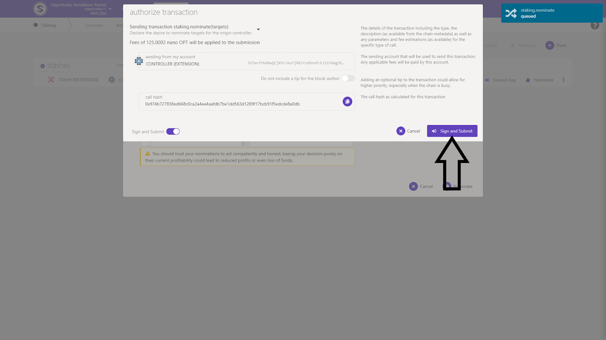

# Becoming a Nominator

Once you have bonding setup, we can nominate our validators. To start the process click _+Nominator_ button. \(By staking You become Nominator on the network\)

Window with the validator list pops up, so it’s time to choose our validators.

Now I’m asking You to pay some attention.

In general, it is recommended to choose those validators who have an identity set, because this allows you to identify the entities that run these servers and thus verify them and gain some confidence in their work.

On mainnet \(now we are on testnet\) if a given server does not work properly or the validator commits dishonest behavior on the network, both it and the nominators who voted for it may face the so-called slash, i.e. a financial penalty in the form of taking away some of the stacked tokens from them.

Such a mechanism encourages you to exercise due diligence in checking the validators you vote for.

If you want to see how a given validator behaved in the past, you can go to the statistics of its operation by clicking on the little chart icon next to the name or address of a given validator. Than, You’ll see such charts with data about the amount at stake, rewards, commison and so on. In encourage You to play with this data to know You validators, especially on coming mainnet.

You are probably already asking which validators to choose.

Therefore, I recommend you to use the services of early supporters of Standard Protocol and Opportunity Testnet.

They are Standard Protocol community members, close to the team and will play significant roles in this project. They devote their professional lives to the Polkadot ecosystem. They publish substantive content about the ecosystem and provide validation services in the whole Polkadot ecosystem. They are really big enthusiasts of cryptocurrencies.

They provide validation services not only to get paid for it, but most of all to provide services to the network.

Therefore, I encourage you to use their services.

And here they are:

* STAKENODE — _5GHiPeejB4BsqTVMTvFwMi6wXPNpePRmweqZ3Z72gErfruhx_
* STANDARDNODE — _5HKQxLiM6rb1m9Y2Y4f6hGVBnXEAnSgeCYkgDJoEpZ15MugD_
* EAGLENODE — _5ECS6Srw6Eu7CRshd1JV6cXJUi9wFd8DNyrswEdoC9uQHZDC_

So, when you have selected the validators by click on them in the left window click _Nominate_ button.

 _Sign and Submit_ the transaction.

and confirm it with Your password in polkadot.js extension window.

You have just staked Your OPT tokens. Congratulations again! :\)

As you can see in the _Account actions_ section, a position with stacked tokens appears after a while. All our nominations have the status waiting at the moment, because our nominations will become active \(will enter the blockchain with the beginning of a new era\). When this happens, you can check the overview tab where on the right side you have the Era Duration and Epoch Duration.

When our nominations go to the blockchain, we will always see in this section one active validator from whom we will receive awards, inactive validators, i.e. those that we have chosen, but do not generate rewards at a given time, but they will generate in the next eras.

In addition, pending validators may also appear here, i.e. the ones we chose even though they were not active, i.e. they were on the waiting list.

Going on the right side of our position we have three dots with additional options underneath. We can remove our stake, increase it, etc.

But enough knowledge for now. :\) I will explain this in the next guide. I will show You how to pay out rewards also.

